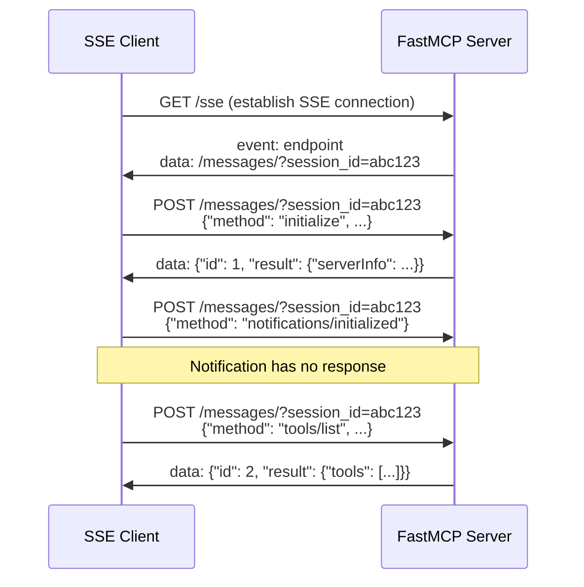

# FastMCP Integration Guide

## Overview

This document details the complete FastMCP (Model Context Protocol) integration implemented in the Conversation Bot, including the successful Azure DevOps server integration using Server-Sent Events (SSE) transport.

## Table of Contents

1. [Architecture Overview](#architecture-overview)
2. [FastMCP SSE Protocol Implementation](#fastmcp-sse-protocol-implementation)
3. [Azure DevOps Integration](#azure-devops-integration)
4. [Technical Challenges & Solutions](#technical-challenges--solutions)
5. [Usage Examples](#usage-examples)
6. [Testing & Validation](#testing--validation)
7. [Troubleshooting](#troubleshooting)

## Architecture Overview

### Core Components

The FastMCP integration consists of several key components working together:

```
┌─────────────────┐    ┌──────────────────┐    ┌─────────────────────┐
│   MCP Agent     │    │ Protocol Client  │    │   SSE Client       │
│                 │────│                  │────│                    │
│ - Tool routing  │    │ - Auto-detection │    │ - Session mgmt     │
│ - Execution     │    │ - Transport      │    │ - Async responses  │
└─────────────────┘    └──────────────────┘    └─────────────────────┘
         │                       │                       │
         │                       │                       │
         ▼                       ▼                       ▼
┌─────────────────┐    ┌──────────────────┐    ┌─────────────────────┐
│  Tool Manager   │    │ Server Manager   │    │  FastMCP Server     │
│                 │    │                  │    │                     │
│ - Discovery     │    │ - Connections    │    │ - Azure DevOps API  │
│ - Registration  │    │ - Lifecycle      │    │ - 9+ Tools          │
└─────────────────┘    └──────────────────┘    └─────────────────────┘
```

### Key Files and Responsibilities

| Component | File | Responsibility |
|-----------|------|----------------|
| **SSE Client** | `utils/mcp_sse_client.py` | FastMCP SSE protocol implementation |
| **Protocol Client** | `utils/mcp_protocol_client.py` | Transport auto-detection and unified interface |
| **Tool Manager** | `utils/tool_manager.py` | Tool discovery and management across servers |
| **Server Manager** | `utils/mcp_server_manager.py` | Server lifecycle and connection management |
| **MCP Agent** | `agents/mcp_agent.py` | High-level agent interface for tool execution |
| **Dynamic Handler** | `utils/dynamic_tool_handler.py` | Runtime tool execution and routing |

## FastMCP SSE Protocol Implementation

### Protocol Sequence

The FastMCP SSE protocol requires a specific initialization sequence that we've successfully implemented:



### Key Implementation Details

#### 1. Session Management

```python
# Extract session ID from SSE events
if line_str.startswith("data: /messages/?session_id="):
    match = re.search(r'session_id=([a-f0-9]{32})', line_str)
    if match:
        self.session_id = match.group(1)
```

#### 2. Persistent SSE Connections

```python
# Maintain persistent connection for bidirectional communication
self.sse_connection = await self.session.get(
    self.sse_url, 
    headers={'Accept': 'text/event-stream'}
)
```

#### 3. Async Response Handling

```python
# Wait for responses via SSE stream
async for line in self.sse_connection.content:
    if line_str.startswith('data: {'):
        json_data = json.loads(line_str[6:])
        if json_data.get("id") == request_id:
            return json_data
```

### Protocol Features

- ✅ **Complete MCP Handshake**: `initialize` → `notifications/initialized` → `tools/list`
- ✅ **Session ID Extraction**: Automatic extraction from server-provided SSE events
- ✅ **Bidirectional Communication**: HTTP POST for requests, SSE stream for responses
- ✅ **Async Response Matching**: Request/response correlation using JSON-RPC IDs
- ✅ **Error Handling**: Graceful handling of timeouts and connection issues

## Azure DevOps Integration

### Discovered Tools

The FastMCP Azure DevOps server provides 9 comprehensive tools:

| Tool Name | Description | Key Parameters |
|-----------|-------------|----------------|
| `list_projects` | List all projects in the organization | None |
| `list_work_items` | List and filter work items | `project`, `work_item_type`, `assigned_to`, `state`, `limit` |
| `get_work_item` | Get detailed work item information | `work_item_id`, `project` |
| `create_work_item` | Create new work items | `work_item_type`, `title`, `project`, `description`, etc. |
| `update_work_item_state` | Change work item status | `work_item_id`, `new_state`, `project` |
| `search_work_items` | Search work items by text | `search_text`, `project`, `limit` |
| `get_work_item_comments` | Get work item discussions | `work_item_id`, `project` |
| `add_task_to_work_item` | Create child tasks | `parent_id`, `title`, `project`, `description`, etc. |
| `link_work_items` | Create work item relationships | `source_id`, `target_id`, `link_type`, `project` |

### Environment Configuration

Required environment variables for Azure DevOps integration:

```bash
AZURE_DEVOPS_ORG_URL=https://dev.azure.com/yourorg
AZURE_DEVOPS_PAT=your-personal-access-token
AZURE_DEVOPS_PROJECT=your-default-project-name  # Optional
AZURE_USERNAME=your-email@domain.com            # Optional
```

### Server Configuration

Add to `config/mcp_servers.json`:

```json
{
  "azure-devops": {
    "url": "http://localhost:8000/sse",
    "description": "Azure DevOps MCP Server - FastMCP with SSE transport",
    "enabled": true
  }
}
```

## Technical Challenges & Solutions

### Challenge 1: Invalid Request Parameters

**Problem**: Initial `tools/list` requests returned error `-32602: Invalid request parameters`

**Root Cause**: FastMCP requires complete initialization sequence before accepting tool requests

**Solution**: Implemented proper MCP handshake:
```python
# 1. Initialize MCP session
init_result = await client.initialize_mcp()

# 2. Send initialized notification
notification = {"jsonrpc": "2.0", "method": "notifications/initialized"}
await client._send_request(notification)

# 3. Now tools/list works
tools = await client.discover_tools()
```

### Challenge 2: Session ID Extraction

**Problem**: Server requires specific session IDs but we weren't extracting them correctly

**Root Cause**: Session IDs are provided via SSE events in a specific format

**Solution**: Enhanced regex pattern and event parsing:
```python
# Extract 32-character session ID from SSE events
match = re.search(r'session_id=([a-f0-9]{32})', line_str)
```

### Challenge 3: SSE Response Handling

**Problem**: Responses were timing out despite successful request submission

**Root Cause**: FastMCP sends responses asynchronously via SSE stream, not HTTP responses

**Solution**: Implemented persistent SSE connection with proper response matching:
```python
# Wait for responses on persistent SSE connection
async for line in self.sse_connection.content:
    if line_str.startswith('data: {'):
        json_data = json.loads(line_str[6:])
        if json_data.get("id") == request_id:
            return json_data
```

### Challenge 4: Agent Integration

**Problem**: MCP Agent wasn't discovering tools from connected servers

**Root Cause**: Server connection step was missing from agent initialization

**Solution**: Added explicit server connection in agent initialization:
```python
# Ensure servers are connected before tool discovery
self.server_manager.connect_to_servers(timeout=15)
discovered_tools = await self.tool_manager.discover_all_tools()
```

## Usage Examples

### Basic Tool Discovery

```python
import asyncio
from utils.mcp_sse_client import MCPSSEClient

async def discover_tools():
    client = MCPSSEClient('http://localhost:8000/sse')
    
    # Initialize and discover tools
    await client.initialize_mcp()
    tools = await client.discover_tools()
    
    print(f"Found {len(tools)} tools:")
    for tool in tools:
        print(f"- {tool['name']}: {tool['description']}")
    
    await client.disconnect()

asyncio.run(discover_tools())
```

### Tool Execution

```python
# Execute list_projects tool
result = await client.execute_tool('list_projects', {})

# Execute list_work_items with parameters
result = await client.execute_tool('list_work_items', {
    'input_model': {
        'project': 'DynamicsUnlocked',
        'work_item_type': 'Task',
        'limit': 10
    }
})
```

### Agent Integration

```python
import asyncio
from agents.mcp_agent import MCPAgent

async def test_agent():
    agent = MCPAgent()
    await agent.initialize()
    
    # Agent automatically discovers and registers tools
    response = await agent.get_response('what tools do you have available?')
    print(response)

asyncio.run(test_agent())
```

## Testing & Validation

### Unit Tests

Run the comprehensive test suite:

```bash
# Test FastMCP SSE client
python -c "
import asyncio
from utils.mcp_sse_client import MCPSSEClient

async def test():
    client = MCPSSEClient('http://localhost:8000/sse')
    await client.initialize_mcp()
    tools = await client.discover_tools()
    print(f'✅ Found {len(tools)} tools')
    await client.disconnect()

asyncio.run(test())
"

# Test MCP agent integration
python -c "
import asyncio
from agents.mcp_agent import MCPAgent

async def test():
    agent = MCPAgent()
    await agent.initialize()
    response = await agent.get_response('what tools do you have?')
    print(response)

asyncio.run(test())
"
```

### Integration Validation

Verify the complete integration:

1. **Server Connection**: Ensure Azure DevOps FastMCP server is running on `localhost:8000`
2. **Tool Discovery**: Verify 9 Azure DevOps tools are discovered
3. **Tool Execution**: Test both simple (`list_projects`) and complex (`list_work_items`) tools
4. **Agent Response**: Confirm agent can list and describe all available tools

## Troubleshooting

### Common Issues

#### Issue: "Invalid request parameters" error
**Solution**: Ensure proper MCP initialization sequence is followed

#### Issue: Session ID extraction fails
**Solution**: Verify SSE connection is established and session ID regex pattern is correct

#### Issue: Tools not discovered
**Solution**: Check server connection status and ensure `connect_to_servers()` is called

#### Issue: SSE responses timeout
**Solution**: Verify persistent SSE connection is maintained and response parsing is correct

### Debug Mode

Enable debug logging to troubleshoot issues:

```python
import logging
logging.basicConfig(level=logging.DEBUG)
```

### Server Status

Check if the Azure DevOps FastMCP server is running:

```bash
curl -X GET http://localhost:8000/sse
# Should return SSE stream with session_id
```

## Conclusion

The FastMCP integration successfully provides:

- ✅ **Complete SSE Protocol Support**: Full implementation of FastMCP Server-Sent Events transport
- ✅ **Dynamic Tool Discovery**: Real-time discovery of tools from live servers
- ✅ **Azure DevOps Integration**: 9+ comprehensive work item and project management tools
- ✅ **Robust Error Handling**: Graceful handling of connection issues and timeouts
- ✅ **Agent Integration**: Seamless integration with the conversation bot's agent system

This implementation enables the conversation bot to dynamically discover and execute tools from any FastMCP-compatible server, providing extensible functionality for various integrations beyond Azure DevOps.